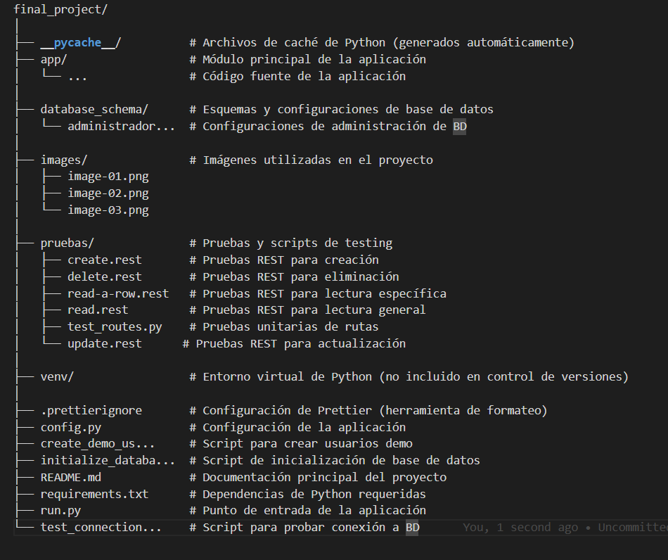

# Proyecto-Micro
Proyecto Final
Universidad Interamericana de Puerto Rico
Recinto de Arecibo
Emmanuel Argüelles Ocasio - R00595934
John Valentín Jiménez - R00628924
Comp-2052
Prof. Dastas

Proyecto Final – Administrador de Eventos

Para nuestro proyecto final de la clase Comp-2052, hemos escogido el sistema para gestionar eventos. Este sistema permite a los usuarios acceder a diferentes tipos de funciones según su rol (Administrador, Organizador y/o Participante). Algunas de estas funciones incluyen manejar, crear o eliminar eventos que serán guardados en la base de datos enlazada al proyecto. Además, el proyecto permite iniciar y cerrar sesión mediante contraseñas protegidas con hash. El profesor otorgó a los alumnos una plantilla de la que se debía derivar el proyecto dependiendo del tema escogido. En nuestro caso, para la base de datos decidimos utilizar MySQL Workbench para crear el enlace y almacenar lo requerido. Este documento es creado con el fin de resaltar los detalles importantes sobre el funcionamiento del proyecto. 

¿Qué hace este sistema?

Es una plataforma web segura para organizar eventos académicos y sociales con tres tipos de usuarios:

Administradores: pueden crear, editar y eliminar todos los eventos.

Organizadores: gestionan solo sus propios eventos.

Participantes: visualizan eventos y se registran.

Todas las contraseñas están protegidas con hash (¡nadie las puede leer!) y los datos se guardan en una base de datos MySQL profesional.

Tecnologías Utilizadas:

Backend: Python + Flask

Base de datos: MySQL Workbench + SQLAlchemy

Frontend: HTML/CSS con plantillas Jinja2

Autenticación: Flask-Login

Formularios: Flask-WTF

Gestión de Roles: Sistema de permisos por rol

Estructura del Proyecto:
---

---

 
 
 
 
 
 
 
 
 
 

